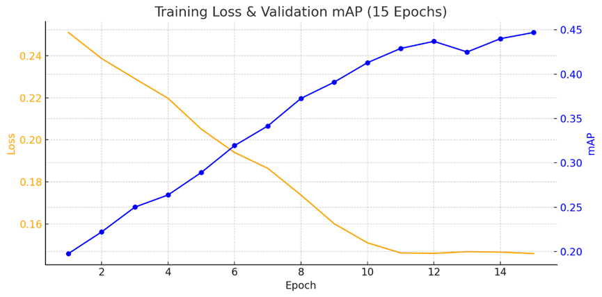

# NYCU Computer Vision 2025 Spring - HW2

**Student ID:** 313554033  
**Name:** 許晴翎  

---

## 📘 Introduction

This project implements a digit object detection model using **Faster R-CNN** with a ResNet-50-FPN backbone.  
The dataset follows COCO format, and the model aims to:

- Detect all digits in an image (Task 1: bounding box + class)
- Predict the full number represented by the image (Task 2)

Key enhancements include:

- ❄️ **Backbone freezing** in early epochs to stabilize learning
- 🧠 **Mixed precision training (AMP)** for faster convergence
- 🔁 **Resume training** from the latest checkpoint
- 📉 **Cosine annealing learning rate scheduler**
- 🎯 Optional **Focal Loss** to address class imbalance
- 🧪 **Data augmentation** pipeline (crop, jitter, flip, affine)
- 📊 **Confidence threshold tuning** to balance precision & recall

---

## ⚙️ Environment Setup (with Conda)

1.  Create a new conda environment:

```bash
conda create -n cv_hw2 python=3.9 -y
conda activate cv_hw2
```
2.  Install dependencies:
""" python 
pip install -r requirements.txt
""" 
3. Prepare your data directory:
```bash
data/
├── train/
├── valid/
└── test/
``` 
Each folder contains .png images.
The corresponding annotations are in COCO-style .json files (e.g., train.json, valid.json).

## 🚀 Usage
🏋️ Train the model
```bash
python train.py \
    --train_root data/train \
    --train_annotation data/train.json \
    --valid_root data/valid \
    --valid_annotation data/valid.json \
    --epochs 15 \
    --save_dir save_model
```
You can resume training automatically if a checkpoint exists in save_model/.

🔎 Run prediction on test set
```bash
python prediction.py \
    --test_images data/test \
    --checkpoint_path save_model/epoch15.pth \
    --output_dir save_result \
    --score_threshold 0.7

```
This generates pred.json, pred.csv, and visualization images under save_result/.

🔢 Generate Task 2 (Full Number Prediction)
```bash
python num_pred.py \
    --box_json save_result/pred.json \
    --output_csv save_result/pred.csv \
    --threshold 0.7

```
## 📈 Results



## 📁 Project Structure
```bash
.
├── train.py              # Main training script
├── prediction.py         # Inference on test set
├── num_pred.py           # Task 2 digit prediction from boxes
├── utils.py              # mAP metric and visualization utils
├── Dataset.py            # Custom dataset for train/test
└── save_result/
    ├── pred.json
    ├── pred.csv
    └── labeled images
```