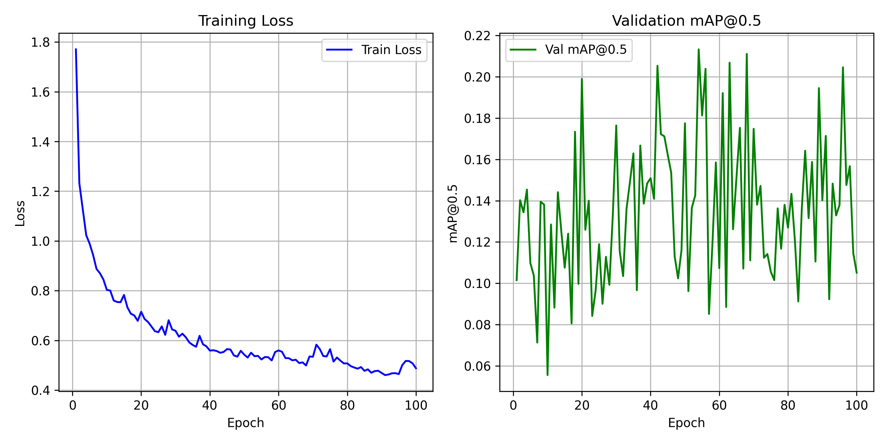

# Medical Cell Instance Segmentation

This repository contains an implementation of an instance segmentation pipeline for four types of medical cells using **Mask R-CNN** with a **ResNet50-FPN** backbone. The project includes data preprocessing, model training, COCO-style evaluation, and inference scripts.
ID：313554033
Name：許晴鈞
---

## 📂 Repository Structure

```
│   README.md
│   requirements.txt
│   train.py                # Training pipeline script
│   inference.py            # Inference pipeline script
│   view_result.py          # Visualization of saved predictions
│   dataset.py              # Custom Dataset for .tif images and masks
│   utils.py                # Model builder, evaluation, and helper functions
│   output.png              # Example segmentation output
│   training_curve.png      # Training loss & validation mAP curves
└── data/                   # Dataset directory (not included)
    ├── train/              # Training samples: each folder contains image.tif + class masks
    └── test/               # Test samples + test_image_name_to_ids.json
```

---

## ⚙️ Requirements

Install dependencies using:

```bash
pip install -r requirements.txt
```

The main requirements include:

* Python 3.8+
* PyTorch
* TorchVision
* pycocotools
* tifffile
* rich
* numpy
* pillow

---

## 🗄️ Data Preparation

1. **Training data**: Place your training folders under `data/train/`. Each sample directory should include:

   * `image.tif`: RGB input image
   * `class1.tif` ... `class4.tif`: instance masks for each cell class

2. **Test data**: Place test images in `data/test/test_release/` and the mapping JSON `test_image_name_to_ids.json` in `data/test/`.

Ensure the folder structure matches the one described above before running the scripts.

---

## 🚀 Usage

### 1. Training

Train the Mask R-CNN model with:

```bash
python train.py \
  --data_dir data/train \
  --batch_size 1 \
  --lr 0.005 \
  --epochs 100 \
  --device cuda \
  --workers 4 \
  --save_dir save_model
```

* **`--data_dir`**: path to training data root
* **`--batch_size`**: batch size per GPU
* **`--lr`**: learning rate
* **`--epochs`**: number of epochs
* **`--device`**: `cuda` or `cpu`
* **`--workers`**: number of DataLoader workers
* **`--save_dir`**: directory to save model checkpoints and metrics

After training, you will find:

* Model weights: `save_model/epoch{n}.pth`
* Metrics: `save_model/train_losses.npy`, `save_model/val_mAP50.npy`
* Plot: `training_curve.png`

### 2. Inference

Generate predictions on test set:

```bash
python inference.py \
  --data_root data/test \
  --model_path save_model/epoch100.pth \
  --batch_size 1 \
  --device cuda \
  --workers 4 \
  --score_thresh 0.5 \
  --save_dir save_result
```

* **`--data_root`**: path to test data root
* **`--model_path`**: path to saved checkpoint
* **`--score_thresh`**: minimum confidence to keep predictions
* **`--save_dir`**: directory to write `test-results.json`

### 3. Visualize Results

Use `view_result.py` to overlay predicted masks/bboxes on images:

```bash
python view_result.py \
  --data_dir data/test/test_release \
  --pred_json save_result/test-results.json \
  --output_dir output_vis
```

* Outputs will be saved as PNG images in `output_vis/`.
* `output.png` in the repo shows an example.

---

## 📈 Example Outputs


Example training loss and validation mAP\@0.5 curves.


---

## 📖 References

1. K. He et al., "Mask R-CNN," in *Proc. IEEE Int. Conf. Comput. Vis. (ICCV)*, 2017.
2. J. Hu et al., "Squeeze-and-Excitation Networks," in *Proc. IEEE Conf. Comput. Vis. Pattern Recognit. (CVPR)*, 2018.
3. COCO Dataset API. [https://github.com/cocodataset/cocoapi](https://github.com/cocodataset/cocoapi)

---

## 📄 License

This project is released under the [MIT License](LICENSE).
