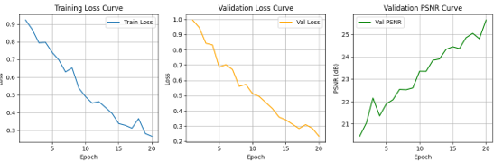
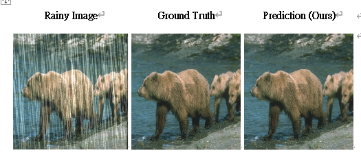

# Image Restoration with PromptIR

ID：313554033
Name：許晴鈞

This repository contains my implementation for the VRDL 2024 Homework 4: Image Restoration, using a Prompt-based Image Restoration (PromptIR) neural network. The code is based on PyTorch Lightning and supports multi-GPU training.

## 📂 Directory Structure

├── net/
│ └── model.py # PromptIR model definition
├── utils/
│ ├── dataset_utils.py # Custom dataset
│ └── schedulers.py # Custom LR schedulers
├── train.py # Main training script (Lightning)
├── inference.py # Inference and .npz generation
├── options.py # Hyperparameters and config
├── test/
│ └── degraded/ # Test degraded images (input)
├── train_ckpt/ # Saved model checkpoints (.ckpt)
├── README.md

## 🚀 Quick Start

### 1. Environment Setup

```bash
conda create -n HW4 python=3.8
conda activate HW4
pip install -r requirements.txt
# (requirements.txt: torch, torchvision, numpy, pillow, matplotlib, lightning, tqdm, wandb, etc.)
```
### 2. Training
Prepare Data
Ensure your training and validation images are organized and update options.py paths accordingly.

Run Training
```python
python train.py
```
Model checkpoints will be saved in train_ckpt/.

Training and validation logs (loss, PSNR) are recorded.

### 3. Inference
To generate submission file (pred.npz) for the test set:


python inference.py
The script loads the trained model and restores all images in test/degraded/.

The results are saved as a dictionary to pred.npz, matching submission format requirements.

### 4. Submission Format
Keys are image filenames (e.g., 0.png, 1.png, ...)

Values are NumPy arrays of shape (3, H, W) (RGB, uint8, same size as input images)

#### 📊  Curves



### result

### 🔧 Model Details
Backbone: PromptIR (custom implementation)

Loss: L1 Loss

Optimizer: AdamW (lr=2e-4)

Scheduler: LinearWarmupCosineAnnealingLR (warmup: 15, max: 20 epochs)

Logging: Wandb/TensorBoard supported

🔍 References
PromptIR [Paper/GitHub (if applicable)](https://github.com/va1shn9v/PromptIR)
